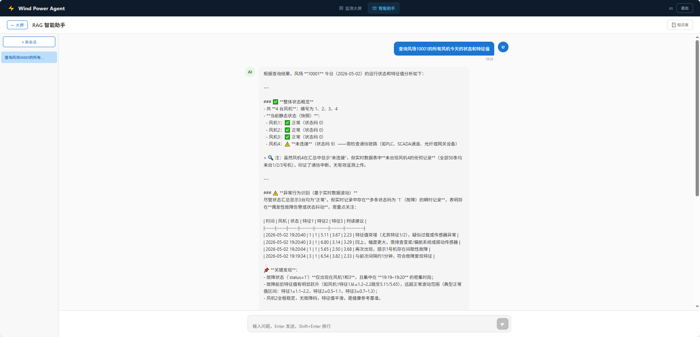
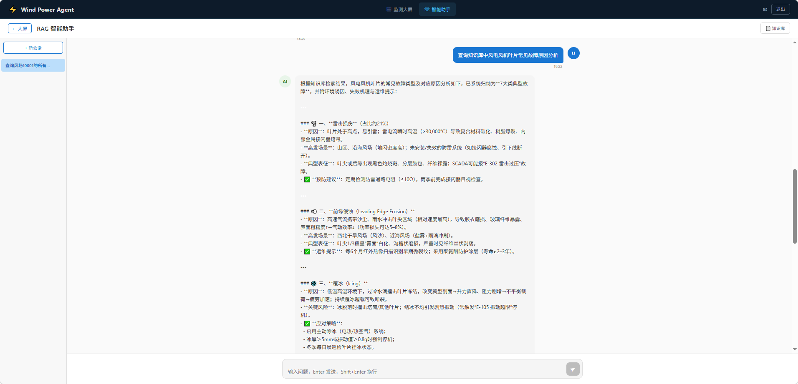

# Intelligent Inspection System for Wind Turbine Blades

## 风电场叶片智能监测与 RAG 智能助手系统

---

> **项目说明**：本项目是基于风场监测系统的重构版本。原项目因涉及商业保密协议无法开源，本仓库为去掉敏感信息后重新架构的微服务版本，新增了 RAG 智能对话、知识库管理、多条件数据查询等能力，并将原单体架构拆分为标准微服务体系。

---

## 界面预览

### 监测大屏


### 工具调用



### 知识库查询



---

## 一、架构概览

```
                          Intelligent Inspection System
+--------------------------------------------------------------------------+
|                                                                          |
|  +---------------------------------------------------------------+      |
|  |                    api-gateway :8080                            |      |
|  |              Spring Cloud Gateway + Nacos                      |      |
|  |     /api/** -> agent-service   /user/** -> auth-service        |      |
|  |     /realtime/** -> realtime-service  /windturbine/** -> ...   |      |
|  +------+------------------+------------------+-------------------+      |
|         |                  |                  |                          |
|         v                  v                  v                          |
|  +------------+  +------------+  +----------------------------------+   |
|  |auth-service|  |realtime-svc|  |         agent-service            |   |
|  |   :8082    |  |   :8083    |  |            :8084                 |   |
|  |            |  |            |  |                                  |   |
|  | JWT        |  | MQTT       |  | RAG + LLM + OpenFeign           |   |
|  | User CRUD  |  | FFT/Curve  |  | Knowledge Base + Degradation    |   |
|  +------+-----+  +--+---+---+--+  +---+---------+---------+--------+   |
|         |           |   |   |        |         |         |             |
|         v           v   |   |        v         v         v             |
|       MySQL       MySQL  |   |     Redis    RabbitMQ  Aliyun          |
|     (hm_user)  (realtime)|   |   (Vector/  (Async/    DashScope       |
|                          |   |   Memory)   MQTT)     (LLM/Embed)      |
|                          v   v                                        |
|                      RabbitMQ  Redis                                  |
|                    (MQTT:1883) (Curve/State)                          |
|                                                                          |
|  +---------------------------------------------------------------+      |
|  |                 wind-power-frontend :5173                       |      |
|  |               Vue 3 + ECharts 5 + TypeScript                   |      |
|  +---------------------------------------------------------------+      |
+--------------------------------------------------------------------------+
```

---

## 二、项目结构

```
Intelligent-Inspection-System-for-Wind-Turbine-Blades/
├── pom.xml                         # Maven 父 POM (5 个子模块)
├── common/                         # 共享库 (不独立部署)
├── auth-service/                   # 用户鉴权服务 :8082
├── realtime-service/               # 风机实时监测服务 :8083
├── agent-service/                  # RAG 智能体服务 :8084
├── api-gateway/                    # API 网关 :8080
├── wind-power-frontend/            # 前端 (Vue 3 + Vite + ECharts)
├── scripts/                        # 工具脚本
│   └── mqtt_simulator.py           # MQTT 数据模拟器
├── image/                          # 项目截图
│   ├── 前端大屏.png
│   ├── 工具调用.png
│   └── 知识库查询.png
└── README.md
```

---

## 三、模块说明

### 3.1 common — 共享库

不独立部署，被 auth-service、realtime-service、agent-service 依赖。


| 类别     | 内容                                                         | 意义                                        |
| -------- | ------------------------------------------------------------ | ------------------------------------------- |
| 通用响应 | `Result<T>`                                                  | 前后端统一 JSON 格式，OpenFeign 反序列化    |
| 安全     | `JwtAuthenticationFilter`, `JwtService`, `JwtConfig`         | 三服务共用一套 JWT 鉴权                     |
| 实体/DTO | `UserDO`, `RealtimeDO`, `WindfarmInfoDO`, `RealtimeQueryDTO` | 跨服务共享，避免 agent 和 realtime 各自定义 |
| 常量     | `Constants`(0/1/9), `CacheConstant`(Redis key)               | 集中管理状态码和缓存键                      |
| 配置     | `RedisConfig`                                                | 统一 JSON 序列化 (Jackson + JavaTimeModule) |

### 3.2 api-gateway :8080

所有前端请求入口。Spring Cloud Gateway (WebFlux/Netty 非阻塞 I/O)。


| 路由                         | 目标                    | 说明                   |
| ---------------------------- | ----------------------- | ---------------------- |
| `/api/**`                    | `lb://agent-service`    | RAG 对话、知识库、降级 |
| `/realtime/**`               | `lb://realtime-service` | 风机监测、特征曲线     |
| `/windturbine/**`            | `lb://realtime-service` | 风机状态查询           |
| `/searchMaxWindturbineId/**` | `lb://realtime-service` | 最大风机编号           |
| `/windfarms/**`              | `lb://realtime-service` | 风场列表               |
| `/user/**`                   | `lb://auth-service`     | 用户登录/注册/管理     |

**为什么需要网关？** 前端只需知道 `:8080`，跨域统一处理，Nacos 动态路由，负载均衡，生产环境可配限流和日志。

### 3.3 auth-service :8082

独立部署，只访问 `hm_user` 表。JWT HS512 算法，24h 有效。


| 端点                       | 说明               |
| -------------------------- | ------------------ |
| `POST /user/login`         | 登录返回 JWT token |
| `POST /user/createNewUser` | 注册新用户         |
| `GET /user/searchAllUser`  | 全部用户列表       |
| `GET /user/searchUser`     | 分页查询           |
| `GET /user/deleteUser`     | 删除用户           |

### 3.4 realtime-service :8083

核心数据接入处理服务。双通道：MQTT (流式遥测) + MySQL (持久化查询)。


| 端点                                         | 说明                             |
| -------------------------------------------- | -------------------------------- |
| `GET /realtime/quaryLatestFeaCurve`          | 特征曲线 (Redis 队列, 20点)      |
| `GET /realtime/query`                        | **多条件灵活查询** (6个可选参数) |
| `GET /realtime/queryWindFarmLastRecord`      | 风场最新 N 条记录                |
| `GET /searchMaxWindturbineId`                | 风场最大风机编号                 |
| `GET /windturbine/queryAllWindturbineStatus` | 风机状态总览                     |
| `GET /windfarms`                             | 列出所有风场及风机数             |
| `GET /realtime/getLatestTxtSpectrumData`     | FFT 频谱数据                     |
| `POST /realtime/insertRealtimeData`          | MQTT 触发的数据写入              |

### 3.5 agent-service :8084

LLM 驱动的智能运维助手。通过 OpenFeign 调用 realtime-service。


| 端点                                          | 说明                        |
| --------------------------------------------- | --------------------------- |
| `POST /api/chat`                              | 同步对话                    |
| `POST /api/chat/stream`                       | **SSE 流式对话** (逐字输出) |
| `GET /api/degradation/status`                 | 降级状态                    |
| `GET /api/sessions`                           | 列出历史会话                |
| `GET /api/sessions/{id}/history`              | 加载会话消息                |
| `DELETE /api/sessions/{id}`                   | 删除会话                    |
| `POST /api/knowledge/upload`                  | 上传 PDF + 触发重建         |
| `POST /api/knowledge/async/clear-and-rebuild` | 异步清空重建                |
| `GET /api/knowledge/async/status`             | 重建进度                    |

---

## 四、服务间调用关系

```
agent-service --OpenFeign--> realtime-service
  (LLM 工具查询风机数据时，通过声明式 HTTP 调用)

api-gateway --Nacos 发现--> lb://agent-service
                          lb://realtime-service
                          lb://auth-service
```

**为什么用 OpenFeign 而非 Dubbo？** 项目使用 Spring Cloud + Nacos，Feign 是声明式 REST，与网关和负载均衡无缝集成，不需要额外的序列化协议和依赖。

---

## 五、数据流

### 5.1 实时监测数据流

```
MQTT 设备 --5s--> RabbitMQ MQTT :1883
                      |
                      v  $share/wind-power-group/windpower/monitoring
              MqttCallbackHandler
                      |  格式: id;cyclecount;state;faultcount;cycle;f1;f2;f3;
                      v
              insertRealtimeData()
                      |
       +--------------+------------------+
       v              v                  v
  MySQL INSERT   Redis SET state     Redis FeaCurveBO
  hm_realtime    wtb:state:{wf}_{t}  wtb:common:fea_curve_{wf}_{t}
  (持久化)       (20s TTL)           (24h TTL, 20点 FIFO)
       |                                |
       v                                v
  LLM 工具查询                      前端 1s 轮询
  (Feign -> 多条件 SQL)             (ECharts 三曲线)
```

### 5.2 RAG 对话流

```
用户: "1号风机最近一周有没有故障"
        |
        v
  agent-service POST /api/chat/stream
        |
        v 降级检查
  ChatMemory (Redis chat:memory 加载上下文)
        |
        v
  LangChain4j @AiService
        |
  +-----+-----------------+
  v     v                 v
RAG   数据查询           历史
向量+ (Feign->           (Redis
关键词 realtime-svc       archive)
重排序 多条件SQL)
  |     |                 |
  +-----+-----------------+
        v
  Qwen-Plus LLM -> SSE 流式输出
```

### 5.3 知识库重建流

```
PDF 上传 -> KnowledgeRebuildProducer -> RabbitMQ
    -> KnowledgeRebuildConsumer
    -> FT.DROPINDEX + AliyunDocParser (智能分割)
    -> Embedding API (text-embedding-v3, 1536维)
    -> Redis RediSearch (索引: wind-farm-knowledge)
    -> 状态回传 -> 前端轮询进度
```

---

## 六、Redis 存储结构

### realtime-service


| Key Pattern                                 | 类型       | TTL     | 读写者                   | 用途                     |
| ------------------------------------------- | ---------- | ------- | ------------------------ | ------------------------ |
| `wtb:common:real_time_max_wt_id_{wf}`       | Integer    | 24h     | MQTT写入/前端读取        | 风场最大风机编号         |
| `wtb:common:real_time_fea_curve_{wf}_{t}`   | FeaCurveBO | 24h     | MQTT写入/前端1s轮询      | 特征曲线 FIFO 队列(20点) |
| `wtb:common:real_time_latest_file`          | Pair       | 24h     | FTP文件监控写入/前端下载 | 最新振动数据文件路径     |
| `wtb:common:wind_turbine_wf_status_{wf}`    | Map        | 24h     | 查询时构建/读取          | 风场所有风机状态快照     |
| `wtb:state:wind_turbine_wt_status_{wf}_{t}` | Integer    | **20s** | MQTT每次写/状态查询读    | 单风机实时状态           |

**设计思路**：24h `common` 保底，20s `state` 保实时。读时先查 common 快照，再逐风机查 state 覆盖最新值。

### agent-service


| Key Pattern                     | 类型                | TTL  | 用途                          |
| ------------------------------- | ------------------- | ---- | ----------------------------- |
| `chat:memory:{sessionId}`       | LangChain4j JSON    | 1天  | 当前会话窗口 (N条消息)        |
| `chat:archive:{sessionId}`      | LangChain4j JSON    | 30天 | 窗口外历史消息归档            |
| `knowledge:rebuild:status:{id}` | Object              | 24h  | 知识库重建进度 (前端轮询)     |
| `wind-farm-knowledge`           | RediSearch 向量索引 | 持久 | 文档 Embedding (1536维, HNSW) |

---

## 七、数据库表结构

```
healthmonitor (MySQL)
+-- hm_realtime          id, windturbine(int), windfarm(varchar11),
|                        status(int:0/1/9), feature1/2/3(double), gmt_received
+-- hm_windfarm_info     id, windfarm, name, windturbine_count, province,
|                        region, unconnected_count, fault_count, health_count
+-- hm_windturbine_info  id, windturbine, windfarm, status, gmt_create, gmt_modified
+-- hm_user              id, name, tel, sex, age, address, user(unique), pwd, position
+-- hm_region            id, name, longitude, latitude, map_level
```

建表 SQL：`realtime-service/src/main/resources/static/healthmonitor.sql` (356 行, 10 风场, 215 条种子数据)

---

## 八、关键技术设计

### 8.1 MQTT 消息格式

```
Topic: $share/wind-power-group/windpower/monitoring
格式:  id;cyclecount;state;faultcount;cycle;feature1;feature2;feature3;
示例:  1;1003;0;0;1.13;0.93;1.0;0.84;

字段: id(风机编号) cyclecount state(0正常/1故障/9未连接)
       faultcount cycle feature1~3(特征值)
```

### 8.2 服务降级

```
NORMAL -> DISABLE_RAG -> DISABLE_TOOL -> EMERGENCY
```

60s 滑动窗口, 5 次错误触发升级。每个组件 (rag/tool/llm) 独立计数。支持手动设置。

### 8.3 Lua 原子操作

```lua
redis.call('SET', KEYS[1], ARGV[1])
redis.call('EXPIRE', KEYS[1], ARGV[2])
return 1
```

替代 Redisson 分布式锁。MQTT shared subscription 保证同一消息只投递一个实例, Redis GET 天然原子。

### 8.4 多条件查询

`GET /realtime/query` 的 6 个可选参数任意组合：


| 参数        | 类型    | 说明                     |
| ----------- | ------- | ------------------------ |
| windfarm    | String  | 风场编号, 如`10001`      |
| windturbine | Integer | 风机编号                 |
| status      | Integer | 0=正常, 1=故障, 9=未连接 |
| startTime   | String  | yyyy-MM-dd HH:mm:ss      |
| endTime     | String  | 同上                     |
| limit       | Integer | 默认 50                  |

MyBatis 动态 `<if>` 标签按需拼接 WHERE 子句。

### 8.5 特征曲线后端队列

`FeaCurveBO.feePoints` 是 `Queue<FeaPointDO>`, 容量 20。MQTT 写入时 `addFeePoint()` 自动淘汰最旧点。前端直接拿队列渲染, 不缓存。

---

## 九、为什么用 Agent？不能手动查询吗？


| 场景                      | 手动查                   | Agent (LLM + 工具)                                                                                  |
| ------------------------- | ------------------------ | --------------------------------------------------------------------------------------------------- |
| "1号风机最近一周有故障吗" | 需知道接口和参数, 手动拼 | LLM 理解意图, 自动调`queryRealtimeData(windfarm='10001', windturbine=1, status=1, startTime='...')` |
| "E-204 是什么故障"        | 需手动翻 PDF 知识库      | LLM 自动调`searchKnowledgeBase(query='E-204')`                                                      |
| 组合查询                  | 多次调接口, 人工整合     | LLM 多轮工具调用, 自动归并                                                                          |
| 跨域查询                  | 需在不同页面/系统间切换  | Agent 统一入口, 串联知识库+数据库                                                                   |

Agent 用 LLM 的自然语言理解替代了传统"查询表单"——用户不需要知道后端有什么接口、什么参数、怎么组合。这对运维人员尤其是新员工降低了很多使用门槛。

---

## 十、前端

```
Vue 3 + Vite 5 + ECharts 5 + Vue Router 4 + Axios

/login      登录/注册 (JWT 认证, 路由守卫)
/dashboard  监测大屏 (左侧风场树->展开风机->右侧曲线, 1s轮询)
/chat       RAG 助手 (左侧会话列表, 中间 SSE 流式对话, 顶部知识库上传)
```

---

## 十一、部署指南

### 环境


| 组件        | 版本             | 端口      |
| ----------- | ---------------- | --------- |
| JDK         | 17               | -         |
| Maven       | 3.8+             | -         |
| MySQL       | 5.7+             | 3306      |
| Redis Stack | 7.x (RediSearch) | 6379      |
| RabbitMQ    | 3.x (MQTT 插件)  | 5672/1883 |
| Nacos       | 2.x              | 8848      |
| Node.js     | 18+              | 5173      |
| Python      | 3.8+ (模拟器)    | -         |

### 步骤

```bash
# 1. 建库
mysql -u root -p -e "CREATE DATABASE IF NOT EXISTS healthmonitor DEFAULT CHARSET utf8mb4"
mysql -u root -p healthmonitor < realtime-service/src/main/resources/static/healthmonitor.sql

# 2. 启动基础设施: MySQL, Redis, Nacos, RabbitMQ
rabbitmq-plugins enable rabbitmq_mqtt

# 3. 编译
cd Intelligent-Inspection-System-for-Wind-Turbine-Blades
mvn clean package -DskipTests

# 4. 启动服务 (严格按此顺序)
java -jar auth-service/target/auth-service-1.0.0-SNAPSHOT.jar
java -jar realtime-service/target/realtime-service-1.0.0-SNAPSHOT.jar
java -jar agent-service/target/agent-service-1.0.0-SNAPSHOT.jar
java -jar api-gateway/target/api-gateway-1.0.0-SNAPSHOT.jar

# 5. 前端
cd wind-power-frontend && npm install && npm run dev

# 6. MQTT 模拟器 (可选)
pip install paho-mqtt && python scripts/mqtt_simulator.py
```

### 验证

```bash
curl http://localhost:8848/nacos/v1/ns/service/list  # 应有 4 个服务
curl http://localhost:8080/actuator/health              # 网关健康
```

---

## 十二、配置管理

Nacos 配置中心, Data ID: `{service-name}.yaml`:


| 服务             | Data ID                 |
| ---------------- | ----------------------- |
| auth-service     | `auth-service.yaml`     |
| realtime-service | `realtime-service.yaml` |
| agent-service    | `agent-service.yaml`    |
| api-gateway      | `api-gateway.yaml`      |

- 本地 `application.yml` 为默认值, Nacos 覆盖
- `refresh-enabled: true` 自动刷新, 改配置无需重启
- 网关路由支持 Nacos 动态变更

---

## 十三、关键设计 FAQ

**Q: 特征曲线为什么放 Redis 而不是数据库？**
A: 大屏 1s 轮询, Redis O(1) 远优于每次 SQL。LLM 工具查数据库是为了灵活的时间范围过滤。

**Q: 鉴权为什么独立成服务？**
A: 支持未来 RBAC 扩展, 可接入 OAuth2/LDAP, 用户表变化不影响其他服务。

**Q: Redis state 为什么 20s TTL 而不是 24h？**
A: MQTT 断连 20s 后状态过期, 前端回退查数据库, 确保不展示旧数据。

**Q: 为什么用微服务而不是单体？**
A: 实时监测 (高吞吐 MQTT + Redis)、RAG (LLM 调用 + RabbitMQ)、鉴权 (轻量 CRUD) 三个域的资源需求和服务特征完全不同, 微服务可以独立扩缩容, 故障隔离。

**Q: 部署时是否需要 Nacos？**
A: 推荐使用。生产环境配置、动态路由、服务发现都依赖 Nacos。本地调试可在 `application.yml` 中配置 `import-check.enabled=false` 跳过。
