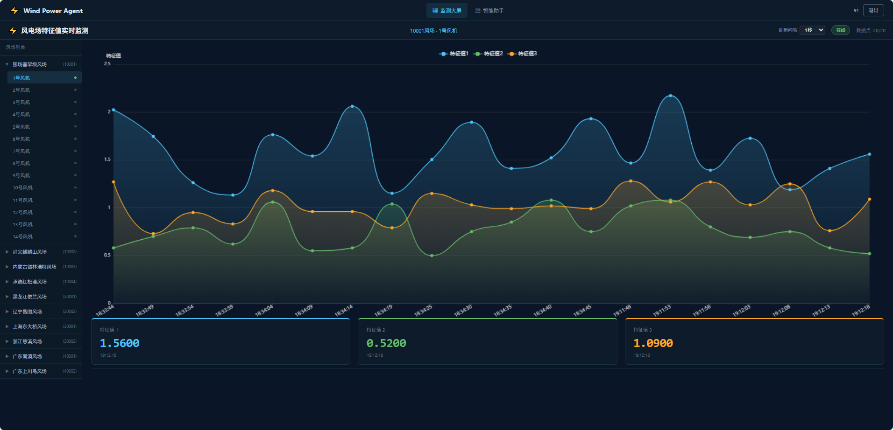
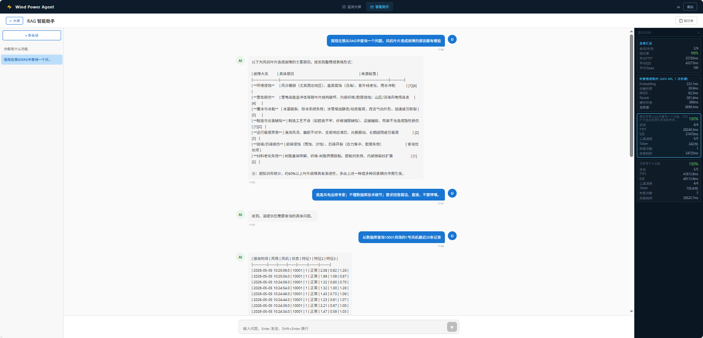

# Intelligent Inspection System for Wind Turbine Blades

## 风电场叶片智能监测与 RAG 智能助手系统

---

> 微服务架构的风电场智能运维系统，集成 MQTT 实时遥测、RAG 知识库检索、多 Agent 路由、多层上下文压缩、用户记忆管理等能力。

---

## 界面预览

### 监测大屏



### 智能助手



---

## 一、架构总览

```
                         Intelligent Inspection System
+--------------------------------------------------------------------------+
|                                                                          |
|  +---------------------------------------------------------------+      |
|  |                    api-gateway :8080                            |      |
|  |              Spring Cloud Gateway + Nacos                      |      |
|  +------+------------------+------------------+-------------------+      |
|         |                  |                  |                          |
|         v                  v                  v                          |
|  +------------+  +------------+  +----------------------------------+   |
|  |auth-service|  |realtime-svc|  |         agent-service            |   |
|  |   :8082    |  |   :8083    |  |            :8084                 |   |
|  | JWT 鉴权   |  | MQTT 遥测  |  | Agent 路由 (Chat/RAG/Query)     |   |
|  | 用户管理   |  | 特征曲线   |  | 4层上下文压缩                  |   |
|  |            |  | 多条件查询 |  | 父子索引 + BM25 + 重排序       |   |
|  +------+-----+  +--+---+---+--+  | 记忆管理 (per-session 本地)   |   |
|         |           |   |   |     | 监控指标 (Session 维度, 持久化)|   |
|         v           v   |   |     +---+--------+--------+--------+   |
|       MySQL       MySQL  |   |        |        |        |            |
|     (hm_user)  (realtime)|   |     Redis   RabbitMQ  Aliyun          |
|                          |   |   (Vector/  (重建     DashScope       |
|                          |   |   BM25/    任务)    (LLM/Embed/      |
|                          v   v   Cache)             Rerank/Token)    |
|                      RabbitMQ  Redis                                 |
|                    (MQTT:1883) (Curve)                               |
|                                                                          |
|  +---------------------------------------------------------------+      |
|  |                 wind-power-frontend :5173                       |      |
|  |               Vue 3 + ECharts 5 + TypeScript                   |      |
|  +---------------------------------------------------------------+      |
+--------------------------------------------------------------------------+
```

---

## 二、各服务功能

### 2.1 agent-service (:8084) — 核心智能体

#### Agent 路由

```
用户消息 → IntentRouter (Qwen-Flash, 一句话分类)
                ↓
    ┌───────────┼───────────┐
    ↓           ↓           ↓
 CHAT         RAG         QUERY
    ↓           ↓           ↓
ChatAssistant RagAssistant QueryAssistant
(Qwen-Flash)  (Qwen-Plus)  (Qwen-Plus)
[memoryTools] [ragTools+   [queryTools+
              memoryTools] memoryTools]
```

| Agent | 模型 | 工具数 | 适用场景 |
|-------|------|--------|---------|
| ChatAssistant | Qwen-Flash | 3 | 闲聊、问候、简单问答 |
| RagAssistant | Qwen-Plus | 3 | 故障诊断、技术规范、知识检索 |
| QueryAssistant | Qwen-Plus | 5 | 风机数据、风场状态、实时监测 |

三个 Agent 共享同一个 ChatMemoryProvider，上下文串行不丢失。

#### 4 层上下文压缩

| 层级 | 阈值 | 动作 |
|------|------|------|
| Layer 1 | 工具结果 >600字符 | Qwen-Flash 结构化行范围摘要 |
| Layer 2 | 消息位于历史前 40% | 旧工具结果 → 过期占位符 |
| Layer 3 | 70% token (350K) | 截断旧消息，保留最近 50 条 |
| Layer 4 | 90% token (450K) | Qwen-Plus LLM 摘要压缩，保留最近 20 条 |

Token 计数使用 DashScope 官方 Tokenizer API 精确计算。

#### 3 层防循环

| 层级 | 机制 |
|------|------|
| Layer 1 | 全局步数上限 (maxSteps=5) |
| Layer 2 | 连续失败黑名单 (maxRetriesPerCall=2，同工具连续失败后阻止) |
| Layer 3 | 降级检查 (系统降级模式) |

#### 知识库检索管道

```
QueryRewrite (Qwen-Plus 改写) → HyDE (假设文档生成)
    → 向量检索 (RediSearch HNSW, 1536维)
    → BM25 关键词检索 (HanLP 分词 + Redis 倒排索引)
    → RRF 融合 (k=60)
    → Aliyun GTE-Rerank 重排序
    → 父子索引 (命中子chunk → 反查父chunk 2000字全文)
    → RAG 缓存 (相似度 ≥0.85 命中, 30min TTL)
```

#### 用户记忆管理

- 四类记忆：`user`(画像) / `feedback`(偏好) / `project`(项目) / `reference`(引用)
- 自动注入：每次对话自动加载当前 session 的记忆为 SystemMessage
- 主动写入：LLM 根据 System Prompt 指引主动调用 saveMemory/updateMemory/deleteMemory
- 存储：`memory/{sessionId}/*.md`，每个 session 独立

#### 工具结果处理

- ≤50 行：全量直接返回给用户
- >50 行：落盘 `data/tool_results/{sessionId}/{timestamp}_{toolName}.txt` + Qwen-Flash 行范围摘要
- 按需读取：`readToolResultFile(path, startLine, endLine)` 指定行范围

#### 监控指标

- Session 维度独立统计：任务成功率、TTFT、E2E、工具调用、Token、检索管道各级耗时
- 持久化：`data/metrics/sessions.json`，30 秒自动落盘，重启不丢失
- 工具失败日志：`data/logs/tool_errors/yyyyMMdd.log`

### 2.2 realtime-service (:8083)

MQTT 遥测数据接收 → MySQL 持久化 + Redis 缓存 → 前端曲线查询。

```
风机板端 --5s--> RabbitMQ MQTT :1883 ($share 共享订阅)
    → MqttCallbackHandler → insertRealtimeDO()
        → MySQL INSERT (hm_realtime)
        → Redis SET state (20s TTL)
        → Redis FeaCurveBO (24h TTL, 20点 FIFO)
```

多实例部署安全：MQTT `$share/` 保证消息不重复，MySQL 自增主键无冲突。

### 2.3 auth-service (:8082)

JWT HS512 鉴权，24h 有效。独立部署，只操作 `hm_user` 表。

### 2.4 api-gateway (:8080)

Spring Cloud Gateway + Nacos 服务发现 + `lb://` 负载均衡。

---

## 三、数据库

```
healthmonitor (MySQL)
├── hm_realtime          # 实时监测数据 (MQTT 写入, status: 0正常/1故障/9未连接)
├── hm_windfarm_info     # 风场信息 (编号→中文名→风机数→省份, 10个风场)
├── hm_windturbine_info  # 风机信息
├── hm_user              # 用户表
└── hm_region            # 区域
```

建表 SQL + 种子数据：`realtime-service/src/main/resources/static/healthmonitor.sql`

---

## 四、Redis 存储

### realtime-service

| Key | 类型 | TTL | 用途 |
|-----|------|-----|------|
| `wtb:state:wt_status_{wf}_{t}` | Integer | 20s | 单风机实时状态 |
| `wtb:common:real_time_fea_curve_{wf}_{t}` | FeaCurveBO | 24h | 特征曲线 (20点 FIFO) |
| `wtb:common:real_time_max_wt_id_{wf}` | Integer | 24h | 风场最大风机编号 |

### agent-service

| Key | 类型 | TTL | 用途 |
|-----|------|-----|------|
| `wind-farm-knowledge` | RediSearch 向量索引 | 持久 | 文档 Embedding (1536维 HNSW) |
| `doc:parent:{md5}` | String | 不过期 | 父子索引父块全文 (重建时清理) |
| `rag:bm25:term:{term}` | Hash | 持久 | BM25 倒排索引 |
| `rag:cache:semantic:{md5}` | Hash | 30min | RAG 语义缓存 |

---

## 五、数据流

### 实时监测

```
MQTT 板端 → RabbitMQ ($share) → realtime-service
    → MySQL (持久) + Redis (缓存)
    → 前端 1s 轮询 (ECharts) / LLM 工具查询 (Feign → SQL)
```

### RAG 对话

```
用户消息 → ChatController (SSE) → AgentRouter.route()
    → IntentRouter.classify() → 对应 Agent
    → LLM + 工具调用 → 结构化摘要/原文
    → SSE 流式输出
```

---

## 六、部署

| 组件 | 端口 | 说明 |
|------|------|------|
| MySQL | 3306 | 数据库 |
| Redis Stack | 6379 | 向量+缓存+BM25 |
| RabbitMQ | 5672/1883 | 消息队列+MQTT |
| Nacos | 8848 | 注册+配置中心 |
| auth-service | 8082 | 鉴权 |
| realtime-service | 8083 | 数据接入 |
| agent-service | 8084 | 智能体 |
| api-gateway | 8080 | 网关 |
| 前端 | 5173 | Vue 3 |

```bash
# 建库
mysql -u root -p -e "CREATE DATABASE healthmonitor DEFAULT CHARSET utf8mb4"
mysql -u root -p healthmonitor < realtime-service/src/main/resources/static/healthmonitor.sql

# 编译
mvn clean package -DskipTests

# 启动 (按顺序)
java -jar auth-service/target/auth-service-1.0.0-SNAPSHOT.jar
java -jar realtime-service/target/realtime-service-1.0.0-SNAPSHOT.jar
java -jar agent-service/target/agent-service-1.0.0-SNAPSHOT.jar
java -jar api-gateway/target/api-gateway-1.0.0-SNAPSHOT.jar

# 前端
cd wind-power-frontend && npm install && npm run dev
```

### 多实例 (realtime-service)

```bash
java -jar realtime-service.jar --server.port=8083 &
java -jar realtime-service.jar --server.port=8084 &
java -jar realtime-service.jar --server.port=8085 &
```

MQTT `$share/` 共享订阅保证消息不重复。

---

## 七、前端

- `/login` — 登录/注册 (JWT)
- `/dashboard` — 监测大屏 (风场树 → 风机 → ECharts 三曲线, 1s 轮询)
- `/chat` — RAG 智能助手 (左侧会话列表, 中间 SSE 流式对话, 右侧监控指标面板)

---

## 八、关键技术决策

**Q: 为什么 Agent 路由用模型分类而不是规则？** 自然语言多样化，Qwen-Flash 一句话分类几乎零成本且准确。

**Q: 上下文压缩为什么不用 TokenWindowChatMemory？** 内置 Token 窗口只截断，4 层压缩保留关键信息同时控制成本。

**Q: 聊天历史为什么存本地 JSON？** 单实例零网络开销，人类可读便于调试。多实例迁移 Redis 即可。

**Q: 特征曲线为什么放 Redis？** 前端 1s 轮询，O(1) 远优于 SQL。LLM 查询走 MySQL 为灵活过滤。

**Q: 父子索引父块为什么不过期？** 父块是知识库的核心资产，仅重建时删除。之前 24h TTL 导致父块过期后检索降级为子块短文本。

**Q: 记忆为什么 per-session 独立？** 不同会话不同用户/场景，共享记忆会污染上下文。
